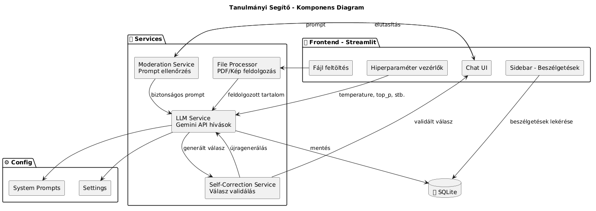
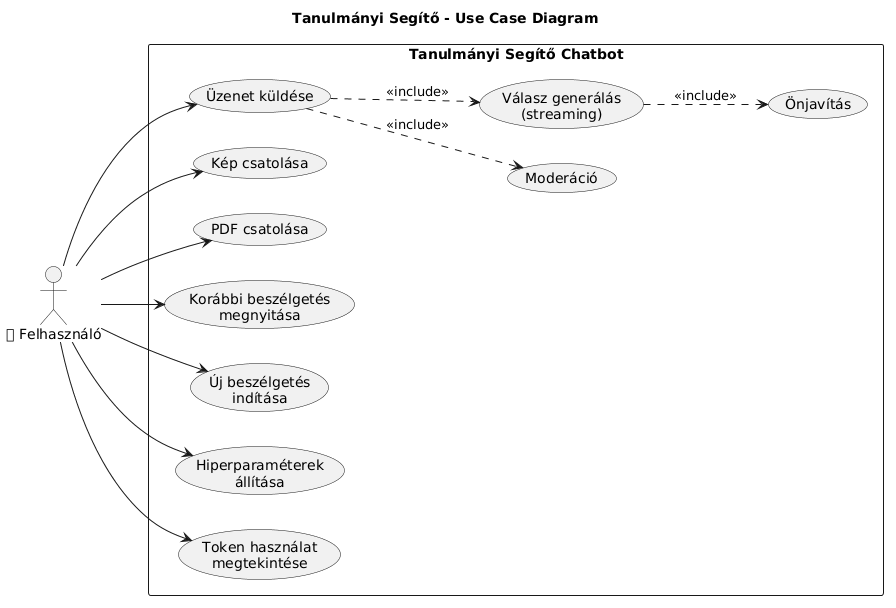
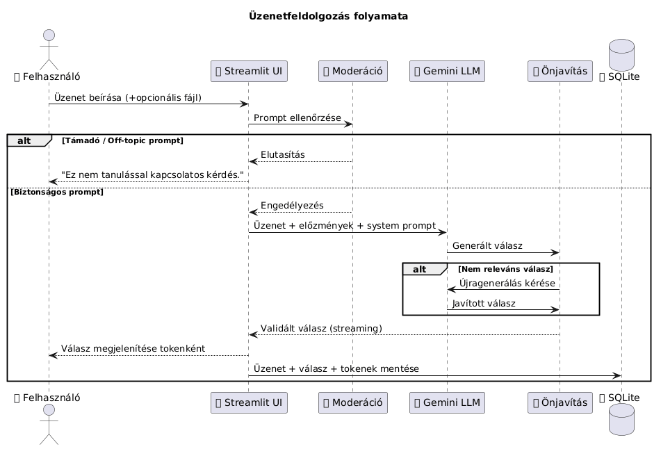
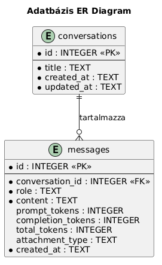

# Architektúra Dokumentáció

## Rendszer áttekintés

Az alkalmazás egy LLM-alapú tanulmányi segítő chatbot, amely a Google Gemini API-t használja. A felhasználó szöveges kérdéseket tehet fel, PDF-et vagy képet csatolhat, és a rendszer valós idejű streaming válaszokat generál.

## Technológiai stack

| Réteg | Technológia |
|-------|-------------|
| Frontend & App | Streamlit (Python) |
| LLM API | Google Gemini |
| Adatbázis | SQLite (aiosqlite) |
| Nyelv | Python 3.x |

## Komponens diagram

## Use Case diagram

## Szekvencia diagram – Üzenetfeldolgozás

## Üzenetfeldolgozás folyamata

1. A felhasználó beír egy üzenetet (opcionálisan fájlt csatol)
2. **Moderáció:** Külön LLM hívás ellenőrzi, hogy a prompt nem támadó-e
3. Ha biztonságos → a fő LLM megkapja az üzenetet + előzményeket
4. **Önjavítás:** A generált válasz relevanciáját egy másik LLM hívás ellenőrzi
5. Ha releváns → megjelenik a felhasználónak streaming módban
6. Az üzenet és válasz elmentődik az adatbázisba

## Modulok felelősségei

| Modul | Fájl | Felelősség |
|-------|------|------------|
| Fő alkalmazás | app.py | Streamlit UI, felhasználói interakciók |
| LLM Service | services/llm_service.py | Gemini API kommunikáció, streaming |
| Moderation | services/moderation_service.py | Bejövő promptok szűrése |
| Self-Correction | services/self_correction_service.py | Válaszok relevanciájának ellenőrzése |
| File Processor | services/file_processor.py | PDF szöveg kinyerés, kép feldolgozás |
| Database | database/db.py | SQLite CRUD műveletek |
| Settings | config/settings.py | Alkalmazás beállítások |
| System Prompts | config/system_prompts.py | LLM system promptok |

## Adatbázis terv

